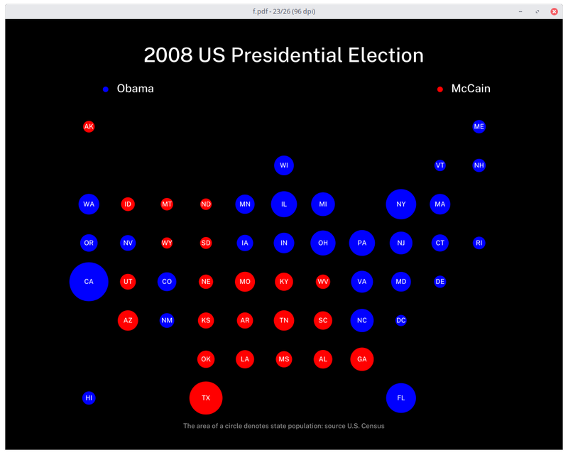
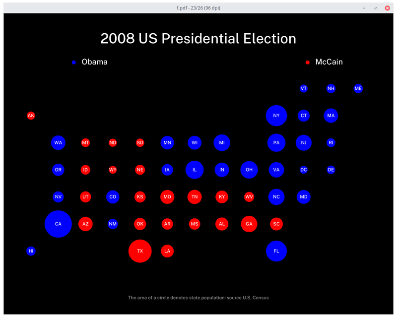

# Election Visualization Notes

## Input data

Input data file format (tab-separated), with columns in this order:
(1) state Abbreviation (for example NJ), 
(2) grid row, 
(3) grid column, 
(4) party which carried the state,
(5) population

A record that begis with the '#' is treated as a comment, and is used to build the header

	# Year Democratic-Candidate Republican-Candidate Third-Party-Candidate

The states are arranged in a grid with rows numbered 0-n west to east, and and columns numbered 0-n north
to south.

The party is designated as 'd' for the Democratic Party, and 'r' for Republican, 'i' for independent or third-party.

The population is from the US Census State Intercensal tables, using the data closest 
to the election year. For example, for election year 2020, the data estimated from 2019 is used. 
For the election of 2000, the official 2000 census data is used.

This repository has data files for two layout schemes: files named for year like ```2008.d``` use the layout shown on the Five-Thirty Eight
website. 




Files named with the nyt prefix, like ```nyt-2008.d``` use the layout from the New York Times.



## Running 

	go run elections.go 1920.d 1924.d 1928.d 1932.d 1936.d 1940.d 1944.d 1948.d 1952.d 1956.d 1960.d 1964.d 1968.d 1972.d 1976.d 1980.d 1984.d 1988.d 1992.d 1996.d 2000.d 2004.d 2008.d 2012.d 2016.d 2020.d|decksh|pdfdeck -pagesize 1200,900 -sans PublicSans-Regular -stdout - > elections.pdf


## Data from US Census: 

* https://www.census.gov/search-results.html?q=State+Intercensal+Tables&page=1&stateGeo=none&searchtype=web&cssp=SERP&_charset_=UTF-8
* https://www.census.gov/data/tables/time-series/demo/popest/intercensal-2000-2010-state.html
* https://www.census.gov/data/tables/time-series/demo/popest/pre-1980-state.html
* https://www.census.gov/data/tables/time-series/demo/popest/pre-1980-state.html
